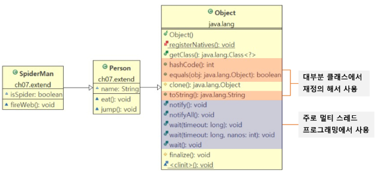
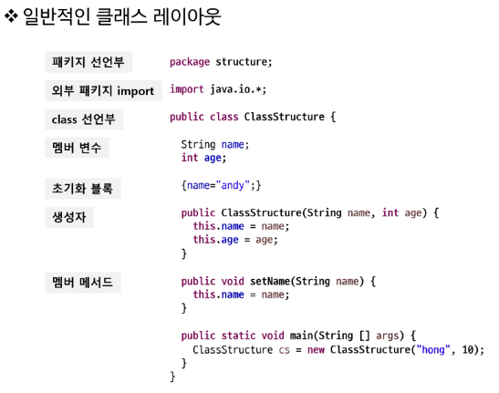
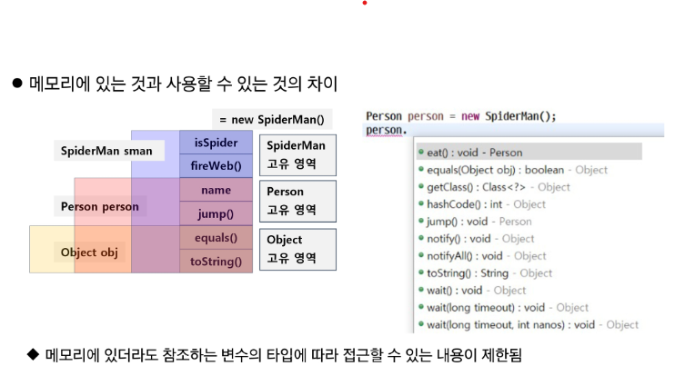

#2022.07.21
---
###*객체지향 언어의 특징*

:smile:**OOP is APIE**

| 특성 | 내용 |
|---|---|
|`Abstraction(추상화)` |  현실의 객체를 추상화 해서 클래스를 구성|
|`Polymorphism(다형성) ` | 하나의 객체를 여러 가지 타입(형)으로 참조할 수 있다|
|`Ingeritance(상속)`     | 부모 클래스의 자산을 물려받아 자식을 정의함으로 코드의 재사용이 가능하다 |
|`Encapsumlation (데이터 은닉과 보호)` | 데이터를 외부에 직접 노출시키지 않고 메서드를 이용해 보호할 수 있다 |

- [ ] 개발자로서 '중복'을 해결하고 있는가?

---
###**상속**

- 기존 클래스의 멤버를 자식 클래스에서 재사용하기 위한 것
- 유지보수성 향상


***실습 Spiderman***
Person.java
```java
package com.ssafy.live2.extend.person;

public class Person {
	String name;
	
	void eat() {
		System.out.println("냠냠.");
	}
	
	void jump() {
		System.out.println("두 다리로 폴짝!");
	}
}
```
:spider:SpiderMan.java
```java
package com.ssafy.live2.extend.person;

public class SpiderMan extends Person{
	boolean isSpider;
	Spider spider;
	
	public SpiderMan() {
		spider = new Spider();
	}
	void fireWeb() {
		if(isSpider) {
			spider.fireWeb(); 
		}else {
			System.out.println("사람일 때는 참자!!");
		}
//		System.out.println("거미줄을 쏘... 어떻게 쏘지?");
	}

}
```
SpiderManTest.java
```java
package com.ssafy.live2.extend.person;

public class SpiderManTest {
	public static void main(String[] args) {
		SpiderMan sman = new SpiderMan();
		sman.eat(); // Person
		sman.jump();// Person
		sman.fireWeb(); // SpiderMan
		sman.isSpider = true;
		sman.eat(); // Person
		sman.jump();// Person
		sman.fireWeb(); // SpiderMan
	}
}
```

>모든 클래스의 조상 클래스가 Object 클래스이다.


<!-- Format:  -->

---
- 상속 관계는 `is a` 관계라고 한다.
Person is a Object, Spiderman is a Person

- 자바는 단일 상속만 지원
  - `interface`와 포함 관계(has a)로 단일 상속의 단점 극복

---
- 포함관계 실습: Spider

>Null Pointer Error : null.xxx // 초기화 되지 않은 내용의 멤버를 참조하려고 하기 때문에 오류가 발생

Spider.java
```java
package com.ssafy.live2.extend.person;

public class Spider {
	void jump() {
		System.out.println("어마어마하게 높은 점프 가능!!");
	}
	
	void fireWeb() {
		System.out.println("거미줄 쉭쉭~~");
	}
}
```

- 어떤 클래스를 상속 받고 어떤 클래스를 포함해야 하는가?

  - ==프로젝트 관점의 문제==, is a와 has a 관계적으로 따져보자

---
###**메서드 재정의**
- 오버라이딩 룰
    - 메서드 이름이 동일
    - 파라미터의 개수, 타입, 순서가 같아야 한다
    - 리턴 타입이 같아야 한다


수정 사항) SpiderMan.java
```java
    void jump() {
		if(isSpider) {
			spider.jump();
		}else {
			System.out.println("두 다리로 폴짝!!");
		}
	}
```
---

:book:**JDK 1.5의 Annotation**
- @Deprecated
    - 컴파일러에게 해당 메서드가 deprecated 되었다고 알려줌
    - 사용하지 않을 것을 권장, 업데이트 후 없어질 수 있음
- @Override
    - 컴파일러에게 해당 메서드는 override한 메서드 임을 알려줌
    - @Override가 선언된 경우 반드시 super class에 선언 되어있는 메서드여야 함 (잘못 명시할 경우 오류 발생)
- @SuppressWarnings
    - 컴파일러에게 사소한 warning의 경우 신경 쓰지 말라고 알려줌

:spider_web:SpiderMan.java
```java
.
.
.
    @Deprecated
	void love() {
		System.out.println("메리제인 사랑해!");
	}
```
SpiderManTest.java
```java
@SuppressWarnings("deprecation")
public class SpiderManTest {
.
.
.
}
```
---

**toString() 메서드**
- 객체를 문자열로 변경하는 메서드
- 객체를 반환하면 toString() 반환값을 얻을 수 있음

Person.java
```java
.
.
.
    @Override
	public String toString() {
	    return "person:, name: "+this.name;
	}
	
```

SpiderMan.java
```java
.
.
.
    @Override
	public String toString() {
		return super.toString()+", isSpider: "+isSpider;
	}
```
---
**super 키워드**
- this()가 해당 클래스의 다른 생성자를 호출하듯 `super()는 조상 클래스의 생성자 호출`
- super()는 자식 클래스 생성자의 맨 첫 줄에서만 호출 가능
- 명시적으로 this() 또는 super()를 호출하지 않는 경우 컴파일러가 super() 삽입

```java
class Person2{
    String name;

    Person2(String name){
        // super(); // -> Object의 기본 생성자 호출
        this.name = name;
    }
}
```

```java
class Person2{
    String name;
    Person2(String name){
        this.name = name;
    }
}

public class SpiderMan3 extends Person2{
    Spider spider = new Spider();
    boolean isSpider;

    SpiderMan3(String name, Spider spider, boolean isSpider){
        super(name);
        this.spider = spider;
        this.isSpider = isSpider;
    }

    SpiderMan3(String name){
        this(name, new Spider(), true);
    }

    public static void main(String[] args){
        SpiderMan3 sman = new SpiderMan3("피터 파커");
    }
}
```
---
**Package**
- PC의 많은 파일 관리 -> 폴더 이용
- 프로그램의 많은 클래스 -> 패키지 이용
- package 선언 -> default package는 사용하지 않는다
- 일반적인 package naming rule
    - 소속.프로젝트.용도 (com.ssafy.hrm.common)

**import**
- 다른 패키지에 선언된 클래스를 사용하기 위한 키워드
- 선언 방법
    - import 패키지명.클래스명;
- 클래스 이름이 동일하여 명확히 구분할 때
    - java.util.List list = new java.util.ArrayList();

**일반적인 클래스 레이아웃**



---
**제한자(modifier)**
- 접근 제한자 : public, protected, (default = package), private
- 그 외의 제한자
	- static : 클래스 레벨의 요소 설정
	- fibal : 요소를 더 이상 수정할 수 없게 함
	- abstract : 추상 메서드 및 추상 클래스 작성
	- synchronized : 멀티스레드에서의 동기화 처리
	- 기타 등등

*final*
- final class -> 더 이상 확장할 수 없음 : 상속 금지 -> 오버라이드 방지
	- 완벽한 클래스 ex) String, Math, ...etc
- final method -> 더 이상 재정의 할 수 없음 : overriding 금지
- final variable -> 더 이상 값을 바꿀 수 없음 : 상수화


**접근 제한자**
public, protected(default), package, private
`멤버를 관리하는 기준은 무엇인가요?`
- 사용자를 얼마나 신뢰할 수 있는가?
	- 멤버를 접근하는 유저가 원하거나 필요한 부분만을 제공하면 된다.
- 무결성, 신뢰성, 보안의 이유로 레벨을 나눠서 리소스를 관리함

*실습. modifier p1*

Parent.java
```java
package com.ssafy.live2.modifier.p1;

public class Parent {
	public int publicVar;
	protected int protectVar;
	int defaultVar;
	@SuppressWarnings("unused")
    private int privVar;
	
	public void useMember() {
		this.publicVar = 10;
		this.protectVar = 10;
		this.defaultVar = 10;
		this.privVar = 10;
	}
}
```
SamePackageChildClass.java
```java
package com.ssafy.live2.modifier.p1;

import java.security.ProtectionDomain;

// TODO: Parent를 상속받고 Parent의 member들에 접근해보세요.
 public class SamePackageChildClass extends Parent{
    public void method() {
    	this.publicVar = 10;
    	this.protectVar = 10;
    	this.defaultVar = 10;
//    	this.privVar = 10;
    }
}
```
SamePackageSomeClass.java
```java
package com.ssafy.live2.modifier.p1;

public class SamePackageSomeClass {
	public void method() {
	    // TODO: Parent 객체를 생성하고 이를 통해서 Parent의 멤버에 접근해보세요.
		Parent p = new Parent();
		p.publicVar = 10;
		p.protectVar = 10;
		p.defaultVar = 10;
//		p.priVar = 40;
		
	}
}
```
OtherPackageChildClass.java
```java
package com.ssafy.live2.modifier.p2;

import com.ssafy.live2.modifier.p1.Parent;
//TODO: Parent를 상속받고 Parent의 member들에 접근해보세요.
 public class OtherPackageChildClass extends Parent{
	 
	 public void method() {
		 this.publicVar = 10;
		 this.protectVar = 10;
//		 this.defaultVar = 10;  // default = package (동일 패키지에서만 접근 가능)
//		 this.privVar = 10;
	 }
    // END:
}
```
OtherPackageSomeClass.java
```java
package com.ssafy.live2.modifier.p2;

import com.ssafy.live2.modifier.p1.Parent;

public class OtherPackageSomeClass {
    public void method() {
        // TODO: Parent 객체를 생성하고 이를 통해서 Parent의 멤버에 접근해보세요.
		Parent p = new Parent();
		p.publicVar = 10;
//		p.protectVar = 10;  // 자식과 동일 패키지에서만 접근 가능
//		p.defaultVar = 10;  // 동일 패키지에서 접근 가능
//		p.priVar = 40;	    // 동일 클래스에서 접근 가능
        // END:
    }
}
```

---
**데이터 은닉과 보호(Encapsulation)**
- 누군가 데이터 베이스의 정보를 마음대로 바꾼다면?
- 정보가 보호되지 못하는 이유는? -> 외부에서 변수에 직접 접근하기 때문
- 정보를 보호하기 위한 대책은?
	- 변수는 private 접근 제한자로 막기
	- 공개되는 메서드를 통한 접근 통로 마련 : setter / getter -> 정보 보호 로직 작성

UnbelievableTest.java
```java
package com.ssafy.live2.modifier.encapsulation;

class UnbelievableUserInfo {
	//이름은 null이 될 수 없음.
	public String name = "홍길동";
	// 계좌는 0보다 커야 함.
	
	public int account = 10000;
	
	// TODO: name 과 account에 부적절한 값이 할당되지 못하도록 처리하시오.
	//  name과 account 는 private으로 변경되어야 한다.
    // END:
}

public class UnbelievableTest {
	public static void main(String[] args) {
		UnbelievableUserInfo info = new UnbelievableUserInfo();
		System.out.printf("사용자 정보:%s, %d%n", info.name, info.account);
		info.name = null;   // public으로 접근되기 때문에 데이터는 보호되지 못한다.
		info.account = -1000;
		System.out.printf("사용자 정보:%s, %d%n", info.name, info.account);
	}
}
```
BelievableTest.java
```java
package com.ssafy.live2.modifier.encapsulation;

class BelievableUserInfo {
	//이름은 null이 될 수 없음.
//	public String name = "홍길동";
	// 계좌는 0보다 커야 함.
//	public int account = 10000;
	private String name = "홍길동";
	private int account = 10000;
	
	// TODO: name 과 account에 부적절한 값이 할당되지 못하도록 처리하시오.
	public String getName() {
		return this.name;
	}
	public void setName(String name) {
		if(name != null) {
			this.name = name;
		}else {
			System.out.println("부적절한 값");
		}
	}
	//  name과 account 는 private으로 변경되어야 한다.
    // END:
	public int getAccount() {
		return account;
	}
	public void setAccount(int account) {
		if(account >= 0) {
			this.account = account;
		}else {
			System.out.println("마이너스 통장은 안돼!");
		}
	}
}

public class BelievableTest {
	public static void main(String[] args) {
		UnbelievableUserInfo info = new UnbelievableUserInfo();
		System.out.printf("사용자 정보:%s, %d%n", info.getName(), info.getAccount());
//		info.name = null;
		info.setName("null");
//		info.account = -1000;
		info.setAccount(-1000);
		System.out.printf("사용자 정보:%s, %d%n", info.getName(), info.getAccount());
	}
}
```
---

*객체의 생성 제어와 Singleton 디자인 패턴*
- 객체 생성을 제한해야 한다면?
	- 객체를 계속 생성/삭제하는데 많은 비용이 들어서 재사용이 유리한 경우
	- stateless한 객체일 경우 (수정 가능한 멤버 변수가 없고 기능만 있는 객체)

*Singleton 디자인 패턴*
- 외부에서 생성자에 접근 금지 -> 생성자를 private으로 설정
- 내부에서 private으로 접근 가능하므로 직접 객체 생성
- 외부에서 private member에 접근 가능한 getter() 생성 -> setter는 불필요(수정 없음)
- 객체 없이 외부에서 접근할 수 있도록 getter와 변수에 static 추가
> 외부에서는 언제나 getter를 통해서 객체를 참조하므로 하나의 객체 재사용

SingletonTest.java
```java
package com.ssafy.live2.modifier.singleton;

class SingletonClass{
    // TODO:SingletonClass에 Singleton Design Pattern을 적용하시오.
	// stateless 한 클래스 - 멤버 변수(상태)를 가지지 않고 기능만 가지고 있는 클래스
//	public SingletonClass() {} 여러 객체를 만들 수 있기 때문에 오류 
	private SingletonClass() {}
	private static SingletonClass sc = new SingletonClass();
	public static SingletonClass getSingleTonClass() {
		return sc;
	}
    // END:
    public void sayHello() {
      System.out.println("Hello");
    }
}

public class SingletonTest {
    public static void main(String[] args) {
      // TODO:SingletonClass를 사용해보세요.
//	SingletonClass sc = new SingletonClass();
//	sc.sayHello();
//	SingletonClass sc2 = new SingletonClass(); // 객체를 2개를 만들 필요가 없음, 메모리 낭비
//	sc2.sayHello();
    	SingletonClass sc = SingletonClass.getSingleTonClass();
    	sc.sayHello();
    	
    	SingletonClass sc2 = SingletonClass.getSingleTonClass();
    	sc2.sayHello();
    	
//    	SingletonClass sc3 = new SingletonClass(); 오류
//    	SingletonClass sc4 = sc3.getSingleTonClass();
    	
    	System.out.println(sc==sc2);
//    	System.out.println(sc3==sc4); id가 다르다 (주소가 다름)
	// END:
    }
}
```
---

**다형성(Polymorphism)**
- 하나의 객체가 많은 형태를 가질 수 있는 성질
- 다형성의 정의
	- 상속 관계에 있을 때 조상 클래스의 타입으로 자식 클래스 객체를 레퍼런스할 수 있다.
		- 반대로 자식 클래스가 부모 클래스 타입을 참조할 수는 없다.

PolySpiderTest.java
```java
package com.ssafy.live2.poly;

import com.ssafy.live2.extend.person.SpiderMan;
import com.ssafy.live2.extend.person.Person;

public class PolySpiderTest {
	public static void main(String[] args) {
		SpiderMan sman = new SpiderMan("Peter", false);
		// 다형성 (조상 클래스의 타입으로 자식 클래스 객체를 레퍼런스 가능)
		SpiderMan sman2 = sman;
		Person person = sman;
		Object obj = person;
	}
}
```

*다형성의 사용 이유*
1.다형성으로 다른 타입의 데이터 (Person, SpiderMan)을 하나의 배열로 관리
```java
void beforePoly(){
	Personp[] persons = new Person[10];
	persons[0] = new Person();
	SpiderMan[] spiderMans = new SpiderMan[10];
	spiderMan[0] = new SpiderMan();
}
.
.
void afterPoly(){
	Person[] persons = new Person[10];
	persons[0] = new Person();
	persons[1] = new SpiderMan();
}
```
- Object는 모든 클래스의 조상
	- Object 배열은 어떤 타입의 객체라도 다 저장할 수 있음
	- 기본형 또한 Wrapper class를 통해서 Object가 참조할 수 있음

PolySpiderTest.java
```java
.
.
.
	// 뭐든지 담을 수 있는 만능의 주머니
	Object[] objs = new Object[4];
	objs[0] = sman;
	objs[1] = "Hello";
	objs[2] = objs;
	objs[3] = 1; // 기본형이었는데.. -> autoboxing

	for(Object o : objs) {
		System.out.println(o.getClass().getName());
	}

	System.out.println(sman2);
	System.out.println(sman);
```

2.매개변수 다형성
- 무언가를 출력하고 싶다?
	- 메서드가 호출되기 위해서는 메서드 이름과 파라미터가 맞아야 하는데
```java
public void println(Object x) {
	.
	.
	.
}
```
:family:==조상을 파라미터로 처리한다면 객체의 타입에 따라 만들 필요가 없어진다.==

---
**다형성 활용**

*다형성과 참조형 객체의 형 변환*



*참조형 객체의 형 변환*
```java
// 묵시적 캐스팅
Phone phone = new Phone();
Object obj = phone;

// 명시적 캐스팅
Phone phone = new SmartPhone();
SmartPhone sPhone = (SmartPhone)phone;
```

PolySpiderTest.java
```java
		SpiderMan sman = new SpiderMan("Peter", true);
		// 다형성 (묵시적 캐스팅)
		SpiderMan sman2 = sman;
		Person person = sman;
		Object obj = person;
		
		// 명시적 형 변환
		SpiderMan reSpider = (SpiderMan)obj;
		reSpider.fireWeb(); 
		
		// 뭐든지 담을 수 있는 만능의 주머니
		Object[] objs = new Object[4];
		objs[0] = sman;
		objs[1] = "Hello";
		objs[2] = objs;
		objs[3] = 1; // 기본형이었는데.. -> autoboxing
		
		SpiderMan fromObjArray = (SpiderMan)objs[0];
		fromObjArray.fireWeb();
		
		// 형변환을 할 때는 반드시 타입을 확인하고 하자
		if(objs[1] instanceof SpiderMan) {
			SpiderMan fromObjArray2 = (SpiderMan)objs[1];
			fromObjArray2.fireWeb(); // 오류. "Hello".fireWeb()
		}		
```
---
*참조 변수의 레벨에 따른 객체의 멤버 연결*
- 상속 관계에서 객체의 메서드가 중복될 때(메서드 override되었을 때)
	- ==무조건 자식 클래스의 메서드가 호출됨== -> virtual method invocation
	- 최대한 메모리에 생성된 실제 객체에 최적화된 메서드가 동작

MemberBindingTest.java
```java
package com.ssafy.live2.poly;

class SuperClass{
    String x = "super";
    
    public void method() {
        System.out.println("super class method");
    }
}

class SubClass extends SuperClass{
    String x = "sub";
    
    @Override
    public void method() {
        System.out.println("sub class method");
    }
}

public class MemberBindingTest {
    public static void main(String[] args) {
        SubClass subClass = new SubClass();
        // TODO: 참조 객체의 레벨에 따라 어떤 멤버 변수 또는 메서드가 동작하는지 확인하시오.
        System.out.println(subClass.x);
        subClass.method();
        
        SuperClass superClass = subClass;
        System.out.println(superClass.x);
        superClass.method();
        // END:
    }
}
```
---
AppropriateParameter.java
```java
package com.ssafy.live2.poly;

import com.ssafy.live2.extend.person.Person;
import com.ssafy.live2.extend.person.SpiderMan;

public class AppropriateParameter {
    public void useJump1(Object obj) {
        if (obj instanceof Person) {
            Person casted = (Person) obj;
            casted.jump();
        }
    }

    public void useJump2(Person person) {
        person.jump();
    }

    public void useJump3(SpiderMan spiderMan) {
        spiderMan.jump();
    }

    public static void main(String[] args) {
        Object obj = new Object();
        Person person = new Person();
        SpiderMan sman = new SpiderMan();

        AppropriateParameter ap = new AppropriateParameter();
        // TODO:ap의 useJumpX를 obj, person, sman으로 호출해보세요.
        ap.useJump1(obj);
        ap.useJump1(person);
        ap.useJump1(sman);
        
//      ap.useJump2(obj); 오류
        ap.useJump2(person);
        ap.useJump2(sman);
        
//        ap.useJump3(obj); 오류
//        ap.useJump3(person);
        ap.useJump3(sman);
     
        // END:

    }

}
```
