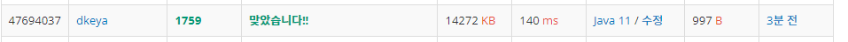

## BoJ_1759_암호만들기

---

<br />

### 코드

```java
import java.util.*;
import java.io.*;

public class BOJ_1759_암호만들기 {
	static StringBuilder sb = new StringBuilder();
	static String[] chars,temp;
	static int L,C;
	static String moeum = "aeiou";
	public static void main(String[] args) throws IOException{
		BufferedReader br = new BufferedReader(new InputStreamReader(System.in));
		StringTokenizer st= new StringTokenizer(br.readLine());
		L = Integer.parseInt(st.nextToken());
		C = Integer.parseInt(st.nextToken());
		temp = new String[L];

		chars = br.readLine().split(" ");
		Arrays.sort(chars);

		combination(0,0);

		System.out.println(sb.toString());

	}

	private static void combination(int cnt, int start) {
		if(cnt == L) {
			String s = String.join("", temp)+"\n";
			int count = 0;
			
			for(int i = 0; i < temp.length; i++) {
				if(moeum.contains(temp[i])) count++;
			}
			
			// 모음이 1개 이상 자음이 두개이상 포함된 경우를 찾기위함
			if(count >= 1 && L-count >=2) sb.append(s); 
			
			return;
		}

		for(int i = start; i < C; i++) {
			temp[cnt] = chars[i];
			combination(cnt+1,i+1);
		}
	}
}
```

<br />


### 결과 : 맞았습니다.

- 메모리 : 14,272KB
- 실행시간 : 140ms
- 코드길이 : 997B

<br />

### 풀이 방법

- 조합(combination)을 이용하여 풀이하였다.
- 초기 입력 데이터를 처리하는 과정에서 후에 사전순으로의 조합을 고려하여 입력문자열 데이터에 대한 정렬을 진행하였다.
- 이후 combination을 이용해 StringBuilder 객체에 문자열을 추가하고 결과를 출력하였다.
- `combination`메서드는 재귀를 사용하였으며 마지막 조합이 완성되었을때 해당 문자열 조합내의 모음의 개수를 카운트하여 모음의 개수가 1개 이상이면서, 자음이 2개이상인지를 체크해주고, 만일 이때 참이라면 StringBuilder 인스턴스에 문자열을 추가해주었다. 
- 초기 문자열 `s`에 `\n(줄바꿈)` 문자열을 포함시켜놓고 if문 내에서의 자음 개수를 s의 길이와 비교하여 결과가 많이 틀렸었다. 
- 다음부터는 조심하자. 

<br />

<span align="center">



</span>

---
