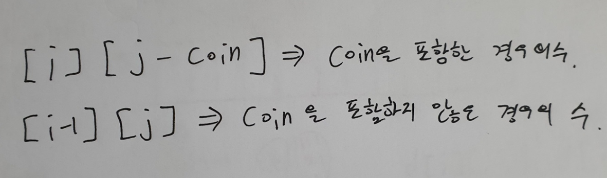

## BoJ_2293_동전1

---

<br />

### 코드

```java
import java.util.*;
import java.io.*;

public class Main {
	static int[] coins;
	static int[][] dp;
	public static void main(String[] args) throws IOException{
		BufferedReader br = new BufferedReader(new InputStreamReader(System.in));
		StringTokenizer st = new StringTokenizer(br.readLine());

		int T = Integer.parseInt(st.nextToken());
		int target = Integer.parseInt(st.nextToken());

		coins = new int[T];
		dp = new int[T][target+1];

		for(int i = 0; i < T; i++) {
			st = new StringTokenizer(br.readLine());
			coins[i] = Integer.parseInt(st.nextToken());
		}

		for(int i = 0; i <= target; i++) {
			if(i % coins[0] == 0) dp[0][i] = 1;
		}

		for(int i = 1; i < T; i++) {
			int coin = coins[i];
			for(int j = 0; j <= target; j++) {
				if(j < coin) dp[i][j] = dp[i-1][j];
				else dp[i][j] = dp[i-1][j] + dp[i][j-coin];
			}
		}
		System.out.println(dp[T-1][target]);
	}
}
```
<br />

### 풀이 방법
- 입력 값의 수가 많아 완전탐색으로 풀기에는 `시간 초과` 오류가 발생할 수 있어 `DP` 를 이용해 풀이하였다.
- 점화식을 세움에 있어서 가장 작은 동전값을 이용해 `dp` 2차원 배열 첫줄을 1로 초기화 해준다. (해당 동전으로만 이루어지므로)
  - 이때 초기화 되는 가격은 가장 작은 동전으로 나누었을때 0인 즉, 해당 동전을 사용해 만들 수 있는 금액의 경우에만 1로 초기화를 한다.
- 이후 다음값들에 대해서 처리해주어야 한다. 여기서 고려사항들이 있다.

  1. 해당 동전값보다 작은 경우에는 이전 동전값을 이용해 만든 경우의수를 그대로 넣어준다. 
  2. 만일 동전값보다 큰 가격인 경우에는 `dp[i][j] = dp[i-1][j] + dp[i][j-coin]` 점화식을 통해 값을 계산한다.

<br />

#### 추가 - 점화식 설명

```java
점화식 : dp[i][j] = dp[i-1][j] + dp[i][j-coin]
```
- `dp[i][j]` : 현재 위치한 인덱스 => 경우의 수를 계산해서 넣어줘야함
- `dp[i-1][j]` : 이전 동전들로 만들 수 있던 경우의수( = coin을 포함하지 않는 경우의 수) 
- `dp[i][j-coin]` : 현재 동전을 포함한 나머지 값에 대한 경우의수(= coin을 포함한 경우의 수)

<span align="center">



</span>

---