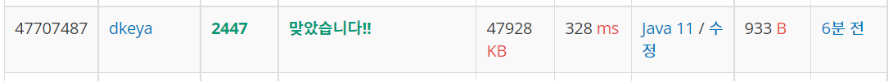

## BoJ_2447_별찍기10

---

<br />

### 코드

```java
import java.util.*;
import java.io.*;

public class Main {
	static char[][] board;
	public static void main(String[] args) throws IOException{
		BufferedReader br = new BufferedReader(new InputStreamReader(System.in));
		StringBuilder sb = new StringBuilder();
		int n = Integer.parseInt(br.readLine());
		board = new char[n][n];
		
		draw(0,0,n);
		
		for(int i =0; i < n; i++) {
			for(int j =0; j < n; j++) {
				if(board[i][j] == '*') sb.append('*');
				else sb.append(' ');
			}
			sb.append("\n");
		}
		
		System.out.println(sb.toString());
	}
	
	private static void draw(int x, int y, int n) {
		if(n == 3) {
			for(int i = x; i<x+3;i++) {
				for(int j = y; j<y+3;j++) {
					if(i == x+1 && j == y+1) continue;
					else board[i][j] = '*';
				}
			}
			return;
		}	
		int l = n / 3 ;
		for(int i = x; i < x+n; i+=l) {
			for(int j = y; j <y+n; j+=l) {
				if(i == x+l && j == y+l) continue;
				draw(i,j,l);
			}
		}
	}
}
```

<br />


### 결과 : 맞았습니다.

- 메모리 : 47,928KB
- 실행시간 : 328ms
- 코드길이 : 933B

<br />

### 풀이 방법

<br />

- draw() 재귀함수를 구현해 풀이하였다. 해당 draw 재귀함수는 초기 시작좌표와 한변의 길이를 매개변수로 받는다. 이때 코드는 종료조건과 재귀조건 두가지로 나뉜다.

  1. n == 3 일때
  2. n != 3 일때

- 먼저 n이 3일때에는 해당 칸에 가운데만을 제외하고 모두 `*` 로 채운다.
- 다음으로 n이 3이 아닐때에는 매개변수로 들어온 n 값을 3으로 나누고, 2차원 배열 기준으로 9등분 하여 각 칸에 대한 재귀를 돌려준다. 단, 이때 가운데 칸은 제외한다. 
- 다른 별찍기들에 비하여 생각할게 많았다. 생각은 단순한데 시간이 너무 오래 걸렸다. 구현하고 보니 코드가 생각보다 단순하고 규칙이 있었다. 

<span align="center">



</span>
---
