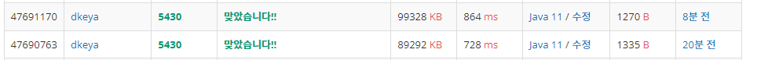

## BoJ_5430_AC

---

- 두가지 방식으로 풀이하였다.
  1. 배열을 사용
  2. Deque 자료구조 사용

<br />

### 코드1 - Array를 사용한 풀이

```java
import java.util.*;
import java.io.*;

public class BOJ_5430_AC_Array {
	public static void main(String[] args) throws IOException{
		BufferedReader br = new BufferedReader(new InputStreamReader(System.in));
		StringBuilder sb = new StringBuilder();
		int T = Integer.parseInt(br.readLine());

		for(int t = 0; t < T; t++) {
			char[] cmd = br.readLine().toCharArray();
			int n = Integer.parseInt(br.readLine());
			String[] temp = br.readLine().replace("[","").replace("]","").split(",");
			//Deque<Integer> dq = new ArrayDeque<>();
			int Rcnt = 0;
			int left = 0;
			int right = n-1;
			boolean flag = false;
			for(int i = 0; i < cmd.length; i++) {
				char c = cmd[i];
				if(c == 'R') {
					Rcnt++;
				}else if(c == 'D') {
					if(left > right) {
						flag = true;
						break;
					}
					if(Rcnt % 2 == 0) {
						left++;
					}else {
						right--;
					}
				}
			}
			if(flag) {
				sb.append("error");
			}else {
				sb.append("[");
				if(Rcnt%2==0) {
					for(int i = left; i < right; i++) {
						sb.append(temp[i] + ",");
					}
					
					if(left <= right) sb.append(temp[right]);
				}
				else {
					for(int i = right; i > left; i--) {
						sb.append(temp[i] + ",");
					}
					if(left <= right) sb.append(temp[left]);
				}
				sb.append("]");
			}

			sb.append("\n");
		}
		
		System.out.println(sb.toString());
	}
}

```

<br />


### 결과 : 맞았습니다.

- 메모리 : 89,292KB
- 실행시간 : 728ms
- 코드길이 : 1335B

<br />

### 풀이 방법
- 배열을 이용하여 처리하였다.
- 문제 조건상 배열 선언 및 탐색을 남발하면 시간초과가 난다는 것은 자명했기에 최대한 탐색횟수를 줄이고자 하였다.
- 이를 위해 `Rcnt => R명령어 등장 횟수` / `left => 왼쪽에서의 인덱스` / `right => 오른쪽에서의 인덱스` 변수를 선언해 활용하였으며 이들은 마지막에 `StringBuilder` 객체에 문자열을 `append` 할때 사용된다.
- 즉, left와 right를 이용해 탐색구간을 조절하였으며, Rcnt를 이용해 앞에서부터인지, 뒤에서부터인지 판단하였다.

<br />


### 코드2 - Deque를 사용한 풀이

```java
import java.util.*;
import java.io.*;

public class BOJ_5430_AC_Deque {
	public static void main(String[] args) throws IOException{
		BufferedReader br = new BufferedReader(new InputStreamReader(System.in));
		StringBuilder sb = new StringBuilder();
		int T = Integer.parseInt(br.readLine());

		for(int t = 0; t < T; t++) {
			char[] cmd = br.readLine().toCharArray();
			int n = Integer.parseInt(br.readLine());
			String[] temp = br.readLine().replace("[","").replace("]","").split(",");
			Deque<String> dq = new ArrayDeque<>();
			for(int i = 0; i < n; i++) {
				dq.add(temp[i]);
			}
			
			int Rcnt = 0;
			boolean flag = false;
			
			for(int i = 0; i < cmd.length; i++) {
				char c = cmd[i];
				if(c == 'R') {
					Rcnt++;
				}else if(c == 'D') {
					if(dq.isEmpty()) {
						flag = true;
						break;
					}
					if(Rcnt % 2 == 0) {
						dq.remove();
					}else {
						dq.removeLast();
					}
				}
			}
			if(flag) {
				sb.append("error");
			}else {
				sb.append("[");
				while(!dq.isEmpty()) {
					if (dq.size() == 1) sb.append(dq.remove());
					else if(Rcnt % 2 == 0) sb.append(dq.remove()+",");
					else if(Rcnt % 2 == 1) sb.append(dq.removeLast()+",");
				}
				sb.append("]");
			}
			sb.append("\n");
		}
		System.out.println(sb.toString());
	}
}

```

<br />


### 결과 : 맞았습니다.

- 메모리 : 99,328KB
- 실행시간 : 864ms
- 코드길이 : 1270B

<br />

### 풀이 방법
- `Deque`을 이용하여 처리하였다.
- 배열과는 다르게 left와 right에 대한 처리가 필요없었으며, 마지막에 `Rcnt`를 이용한 탐색방향만 정의해주면 되었다.
- 배열에 비해 구현이 단순했지만 결과 출력시 생각보다 배열만큼 빠르진 않았다. 왜일까..ㅋㅋ


<br />

<span align = "center">



</span>

<br />


---
