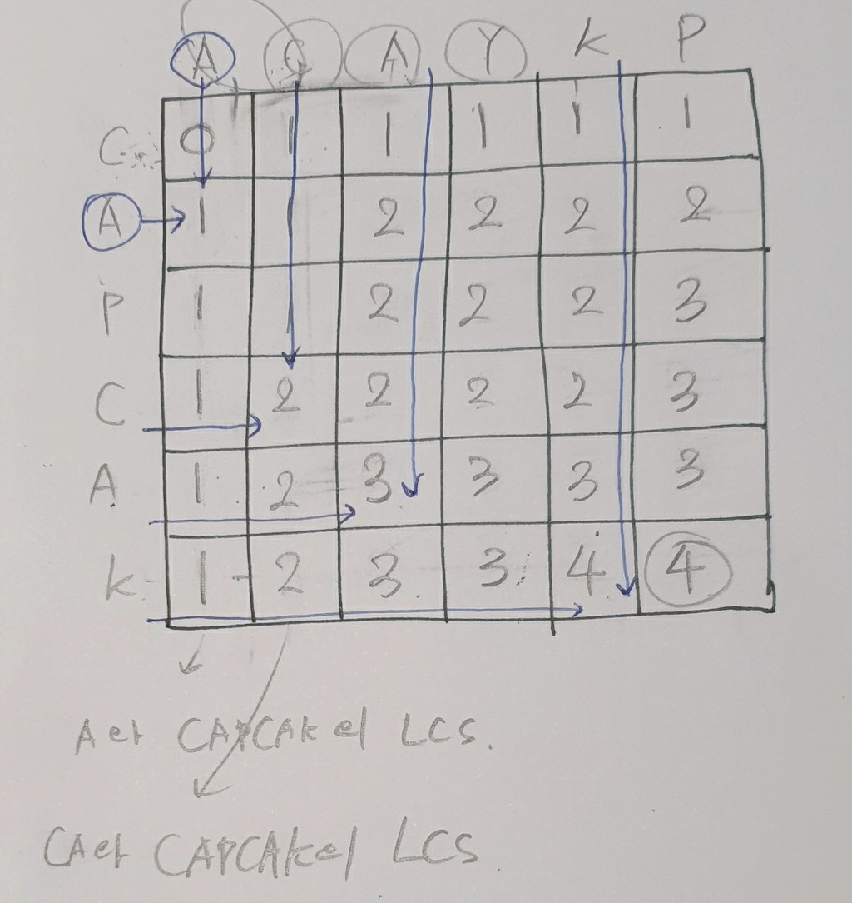
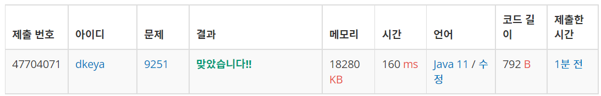

## BoJ_9251_LCS

---

<br />

### 코드

```java
import java.util.*;
import java.io.*;

public class Main {
	public static void main(String[] args) throws IOException{
		BufferedReader br = new BufferedReader(new InputStreamReader(System.in));
		char[] A = br.readLine().toCharArray();
		char[] B = br.readLine().toCharArray();
		
		int N = A.length;
		int M = B.length;
		
		int[][] dp = new int[N+1][M+1];
		
		for(int i = 1; i <= N; i++) {
			for(int j = 1; j <= M; j++) {
				
				// 이전 케이스 + 1 같은 문자의 경우 그 경우를 수열에 추가해주면 되므로
				if(A[i-1] == B[j-1]) {
					dp[i][j] = dp[i-1][j-1]+1; 
				}
				
				// 다른 경우 그떄까지 케이스들 중 가장 긴 길이를 가지도록 함.(현재까지의 LCS 유지)
				else dp[i][j] = Math.max(dp[i-1][j],dp[i][j-1]);
			}
		}		
		System.out.println(dp[N][M]);
	}
}

```

<br />


### 결과 : 맞았습니다.

- 메모리 : 18,280KB
- 실행시간 : 160ms
- 코드길이 : 792B

<br />

### 풀이 방법
- 제한시간 및 메모리제한 그리고 입력의 수를 생각해 보았을때 `DP`를 이용해 풀어야함을 알 수 있었다.
- 이번 DP의 경우는 규칙을 찾으면 되는 문제였다. 
<span a7
lign="center">



- 위의 표를 통해 알 수 있듯이 규칙을 찾자면 두가지 경우가 나뉜다.
  1. 문자가 같은 경우
  2. 문자가 다른 경우

- 먼저, 문자가 같은 경우 이전 경우에 대해 해당 문자의 길이를 추가하면 된다. 이때, 이전 경우란 위의 좌표상 `board[x-1][y-1]` 을 의미한다. => 이것이 의미하는 바는 이전 문자열들까지 해당 두 문자열에서의 LCS를 의미한다. => 즉,서로 각각 하나의 문자씩 추가하면서 LCS길이가 늘어남을 표현하는 부분이다.
- 다음으로, 문자가 다른 경우에는 그때까지의 LCS길이를 가지고 유지하면 된다. 이때 유지할 길이는 위의 표에서를 기준으로 하면 현재 지점에서 위쪽과 왼쪽의 경우 중 더 큰 경우의 값을 가지고 유지하면 된다. => 해당 지점에서는 문자가 달라 어차피 추가해도 값이 변동이 없고 이전까지 계산했던 LCS를 비교해야한다. 이때 비교하는 좌표는 [x-1][y] 와 [x][y-1]의 값이며 이 두 값을 비교하는 이유는 자명하다. => 그때까지의 LCS값 즉, 이때까지 나올 수 있는 수열의 가장 큰 길이를 유지하기 위해서이기 때문. 
- 그렇게 유지한 수열의 길이를 가지고 이후에서도 같은 경우가 나오면 해당 수열에 덧붙여 최종적으로 가장 긴 길이의 수열을 구한다는 의미이다.
- 이를 위해 DP 배열을 선언해 메모이제이션 기법을 사용하였고, 마지막에 `dp[N][M]`에 저장된 가장 긴 수열의 길이를 출력하였다.

</span>


<br />

<span align="center">



</span>

---
