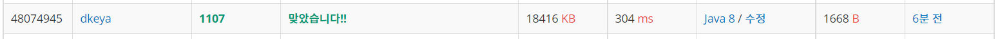

## BoJ_1107_리모콘

---

<br />

### 코드

```java
import java.util.*;
import java.io.*;

public class Main {
	static String N, broken;
	static int M, l;
	static int[] numbers;
	static int[][] data;
	static int[] button;
	static int closeVal = 100;
	static int closeL = 0;
	public static void main(String[] args) throws IOException {
		BufferedReader br = new BufferedReader(new InputStreamReader(System.in));

		N = br.readLine();
		M = Integer.parseInt(br.readLine());
		l = N.length();
		data = new int[l+1][];
		broken = "";
		button = new int[10-M];
		
		StringTokenizer st;
		
		if(M > 0) {
			st  = new StringTokenizer(br.readLine());
		}else {
			st = null;
		}
		
		for(int i = 0; i < M; i++) {
			broken += Integer.parseInt(st.nextToken());
		}
		
		int count = 0;
		for(int i = 0; i < 10; i++) {
			if(broken.contains(Integer.toString(i))) continue;
			button[count++] = i;
		}
		
		if(l-1>0) {
			numbers = new int[l-1];
			permutation(0);
		}
		
		numbers = new int[l];
		permutation(0);
		
		if(l+1 < 7) {
			numbers = new int[l+1];
			permutation(0);
		}
		
		int count1 = Math.abs(closeVal-Integer.parseInt(N));
		System.out.println(Math.min(Math.abs(100-Integer.parseInt(N)), closeL+count1));
	}
	
	private static void permutation(int cnt) {
		if(cnt == numbers.length) {
			int val = 0;
			int order = 1;
			for(int i = numbers.length-1; i >= 0; i--) {
				val += numbers[i] * order;
				order *= 10;
			}
			
			int a = Math.abs(closeVal - Integer.parseInt(N));
			int b = Math.abs(val - Integer.parseInt(N));
			
			if(a > b) {
				closeVal = val;
				closeL = numbers.length;
			}
			
			return;
		}
		
		for(int i = 0; i < 10-M; i++) {
			numbers[cnt] = button[i];
			permutation(cnt+1);
		}
	}
}

```

<br />


### 결과 : 맞았습니다.

- 메모리 : 18,416KB
- 실행시간 : 304ms
- 코드길이 : 1668B

<br />

### 풀이 방법
- 중복순열을 이용한 완전탐색으로 풀이
- 초기 안되는 버튼을 제외한 가능한 버튼들을 이용해 중복 순열을 구하고, 하나의 중복순열로 만들어진 수를 비교하여 가장 가까운 수를 찾는다.
- 이때 중복순열을 구할때에는 한자리 작은수와 한자리 큰수도 함께 중복순열을 구해주었다.(조금 비효율적일 수 있지만)
- 중복순열을 통해 가까운 수를 구하고 나면 처음 시작 번호인 `100번과 목표번호의 차이` vs `가까운수와 가까운수로부터 목표번호의 차이` 값을 비교해 더 작은 값을 출력해 주었다. 

<br />

<span align="center">



</span>


---
