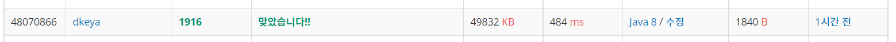

## BoJ_1916_최소비용 구하기

---

<br />

### 코드

```java
import java.util.*;
import java.io.*;

public class Main {
	static int N,M;
	static int[] distance;
	static int[][] board;
	public static void main(String[] args) throws IOException {
		BufferedReader br = new BufferedReader(new InputStreamReader(System.in));

		N = Integer.parseInt(br.readLine()); // 도시의 수
		M = Integer.parseInt(br.readLine()); // 간선의 수

		board = new int[N][N];
		for(int i = 0; i < N; i++) {
			Arrays.fill(board[i], Integer.MAX_VALUE);
		}
		distance = new int[N];
		Arrays.fill(distance, Integer.MAX_VALUE);
		StringTokenizer st;

		for(int i = 0; i < M; i++) {
			st = new StringTokenizer(br.readLine());
			int x = Integer.parseInt(st.nextToken())-1;
			int y = Integer.parseInt(st.nextToken())-1;
			int c = Integer.parseInt(st.nextToken());
			if(board[x][y] > c) board[x][y] = c; 
			// 같은 간선에 대한 정보를 여러번 받을 수 있음 => 즉, 간선은 같지만 비용이 다른 경우를 따져야함
		}

		st = new StringTokenizer(br.readLine());
		int start = Integer.parseInt(st.nextToken())-1;
		int end = Integer.parseInt(st.nextToken())-1;

		dijkstra(start);
		
		System.out.println(distance[end]);
	}

	private static void dijkstra(int start) {
		PriorityQueue<Node> pq = new PriorityQueue<>((a,b)-> {
			if(a.d == b.d) return a.num - b.num;
			else return a.d - b.d;
		});

		pq.offer(new Node(start, 0));
		distance[start] = 0;
		while(!pq.isEmpty()) {
			Node cur = pq.poll();
			int num = cur.num;
			int d = cur.d;
			
			if(distance[num] < d) continue; // 현재 기록해놓은 거리가 해당 노드까지의 거리보다 작다면
			
			for(int i = 0; i < N; i++) {
				if(board[num][i] == Integer.MAX_VALUE) continue;
				int cost = d + board[num][i];
				
				if(cost < distance[i]) {
					distance[i] = cost;
					pq.offer(new Node(i, cost));
				}
			}
			
		}
	}

	static class Node{
		int num;
		int d;
		public Node(int num, int d) {
			super();
			this.num = num;
			this.d = d;
		}
	}
}
```

<br />


### 결과 : 맞았습니다. 

- 메모리 : 49,832KB
- 실행시간 : 484ms
- 코드길이 : 1840B

<br />

### 풀이 방법
- 다익스트라 알고리즘을 이용해 풀이 하였다.
- 다익스트라 알고리즘은 BFS 및 DP를 활용하는 알고리즘으로 출발노드부터 시작해 최종 노드까지 매 순간마다의 최소비용을 가진 노드로 이동하며 현재까지의 비용이 최소비용임을 확신하며 순회하는 알고리즘으로 이해했다.
- 다익스트라 알고리즘을 구현하는 데에는 단순하게 반복문과 배열을 이용해 구현할 수 있지만 이는 후에 노드의 개수가 5000개를 초과하게 되면서부터 시간초과 문제가 발생할 수 있기에 우선순위큐(최소힙)를 이용해 다음으로 이동할 노드를 선정하였다.
- 이를 위해 Node 클래스를 만들고 우선순위 큐는 Node타입을 받아 해당 Node가 가진 거리 값을 기준으로 오름차순 정렬하게 된다. 이후 각 노드로 이동할 때마다 해당 노드에서 이동가능한 노드 를 우선순위큐에 넣고, 이후에도 가장 작은 값을 가진 Node를 따라간다. 

<br />

### 학습 참고 영상
- 이번 다익스트라 알고리즘의 경우에는 유튜브 강의를 통해 플로이드-워셜 알고리즘과 함께 공부하였다.

<span align="center">

[나동빈의 알고리즘 강의 - 다익스트라 & 플로이드 워셜 알고리즘](https://www.youtube.com/watch?v=acqm9mM1P6o&t=16s)

</span>

<span align="center">



</span>
---
